 

  <picture>
    <source
    srcset="images/icon_dark_nl.png"
    media="(prefers-color-scheme: dark)"
    width="150" height="150"
    />
    
  </picture>
  <h1 align="center">Nine Lives Cat Shelter</h1>

A figma design of a cat shelter website in both desktop and mobile modes. It is a fun and simple project I made to test out figma.

## Table of Contents

* [Links](#links)
* [Desktop Screens](#desktop-screens)
* [Mobile Screens](#mobile-screens)

## Links

* Click <a href = "https://www.figma.com/design/JHVkE5I2MypxY643q0hEn7/Nine-lives-cat-shelter?node-id=0-1&t=3hfKPfPfbCTT5XqY-1"> here </a> to visit my figma file and check out the working prototype

## Desktop Screens

### Home Screen

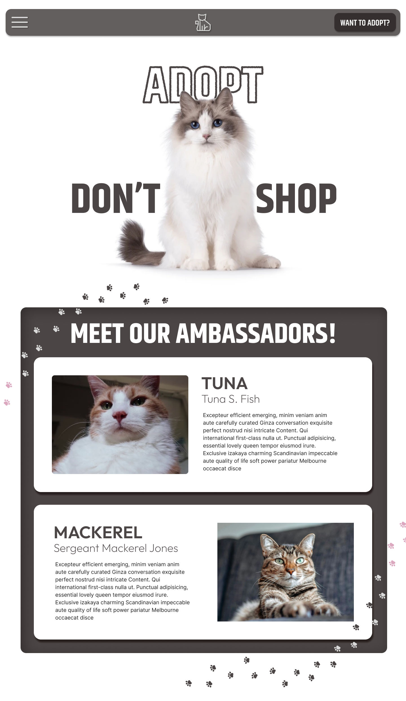

### Adopt screen

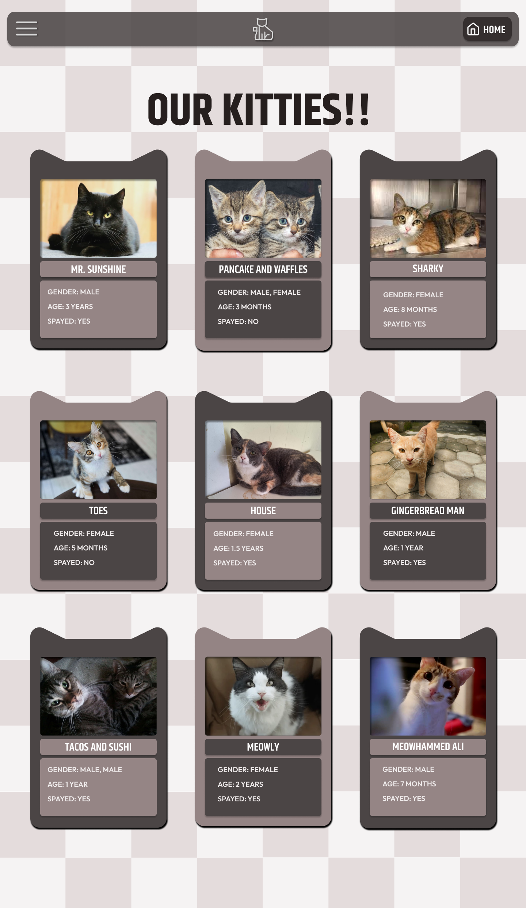

### Cat Screens

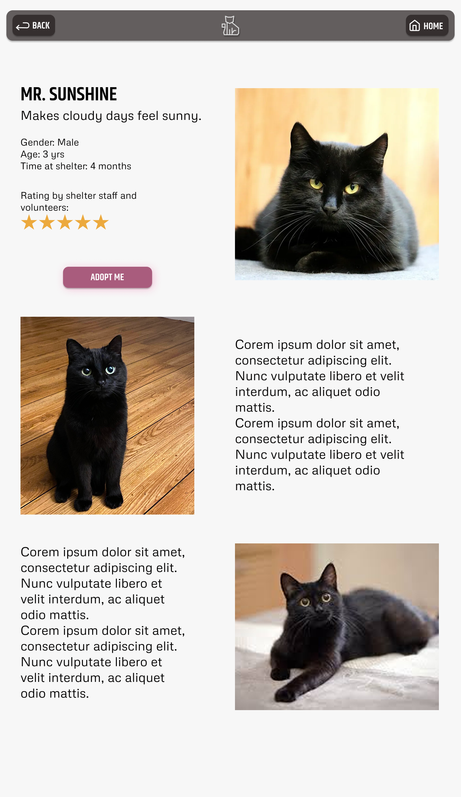

### Others

<h6>Form Screens</h6>
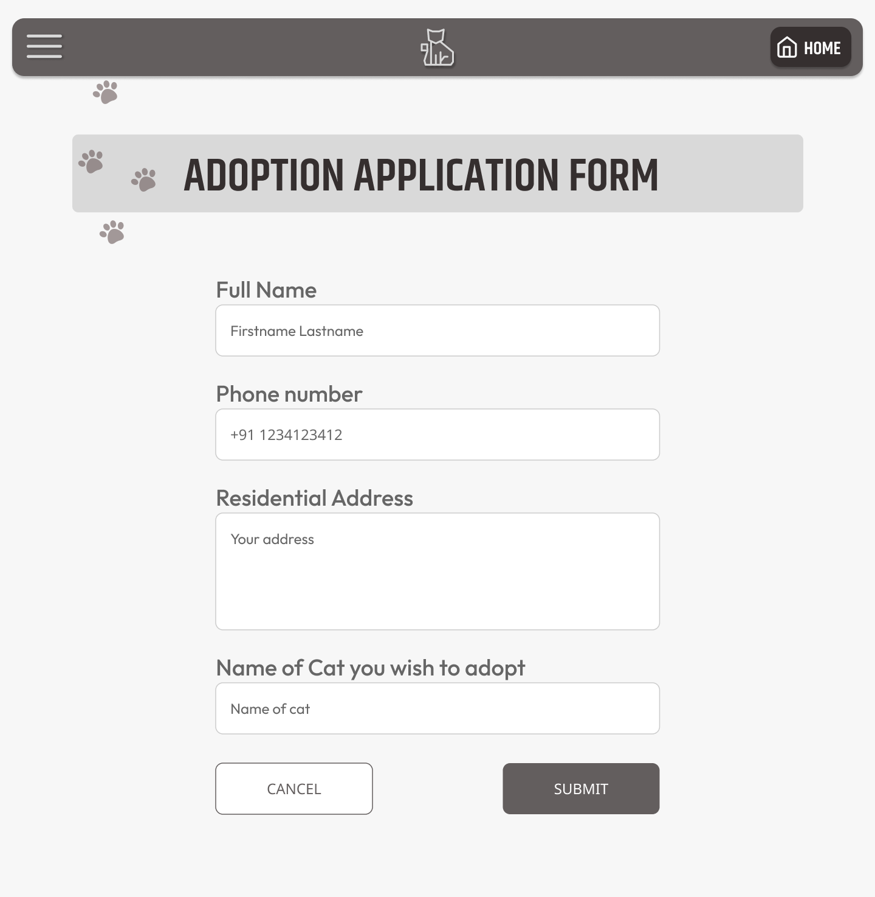
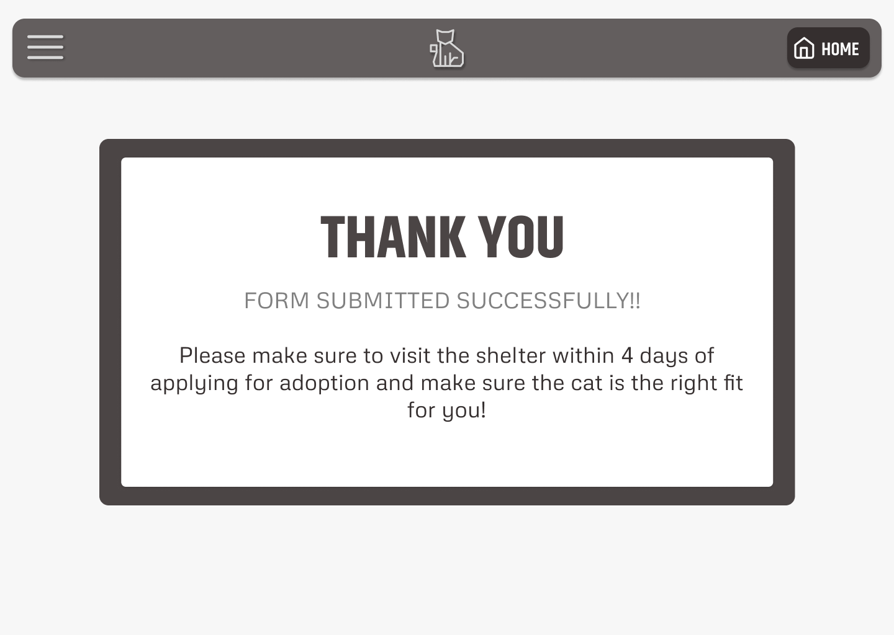

<h6>Location Screen</h6>
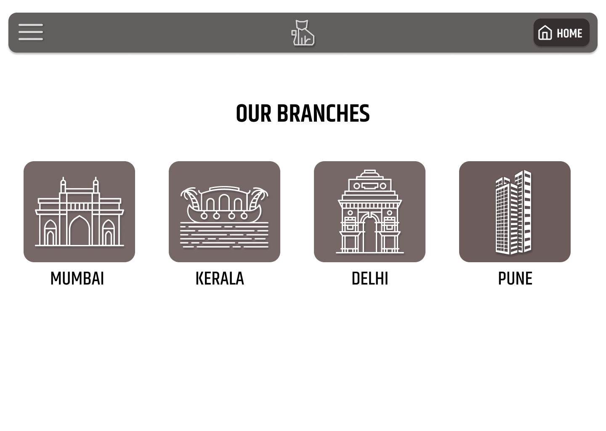

<h6>Donation Screen</h6>
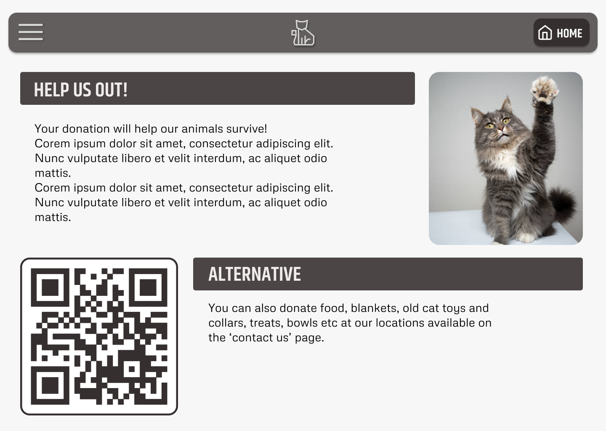

<h6>Sidebar</h6>
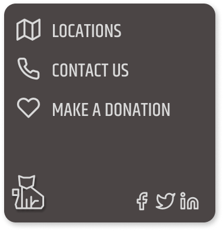

## Mobile Screens

### Home Screen

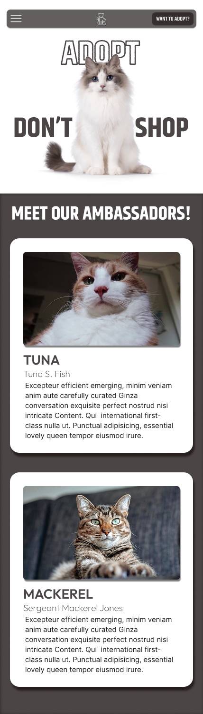

### Adopt screen

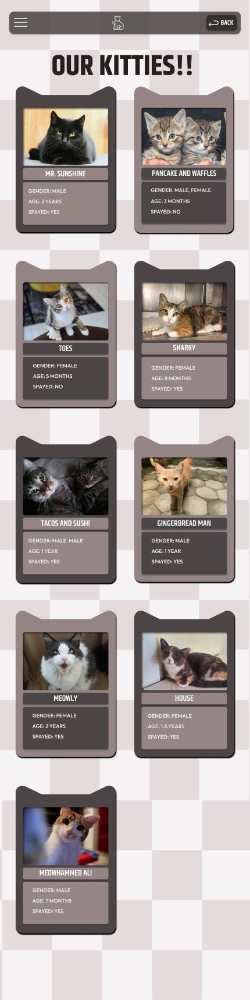

### Cat Screens

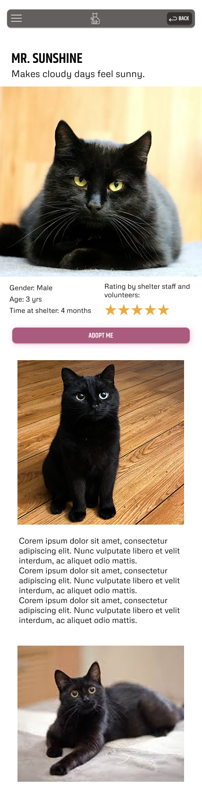

### Others

<h6>Form Screens</h6>
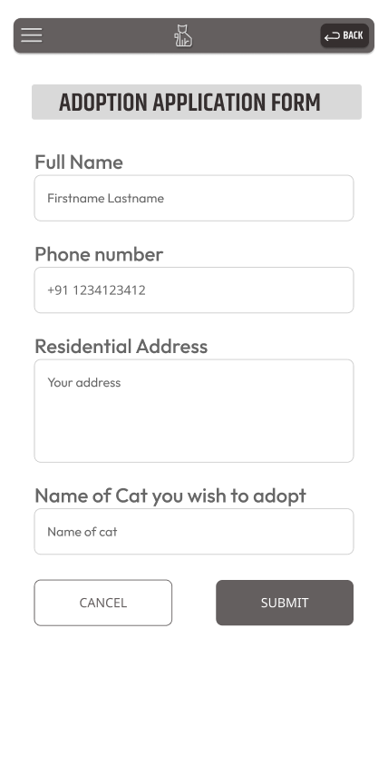
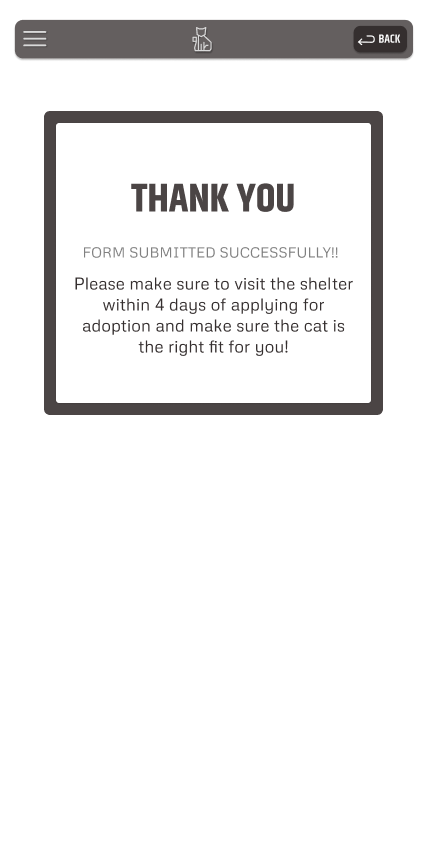

<h6>Location Screen</h6>
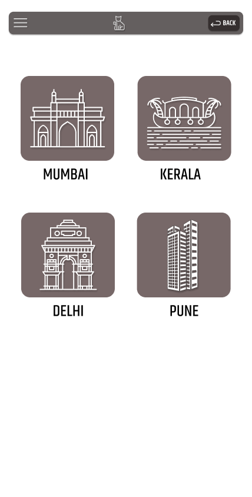

<h6>Donation Screen</h6>
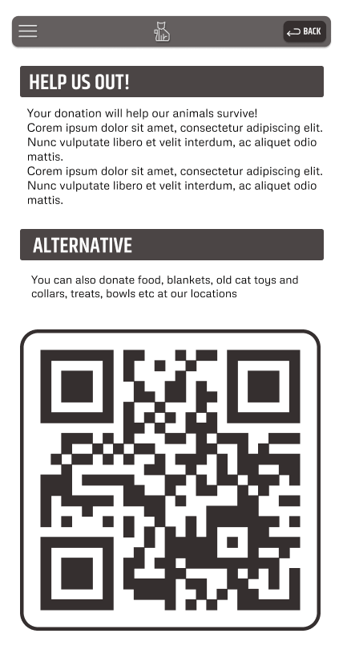

